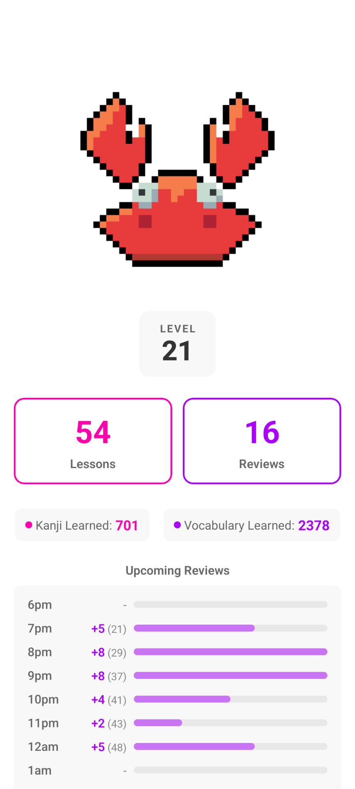
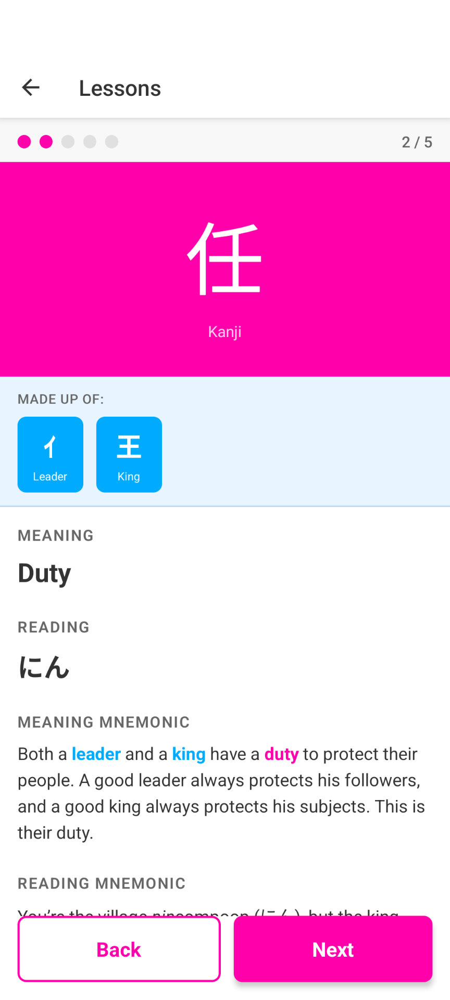
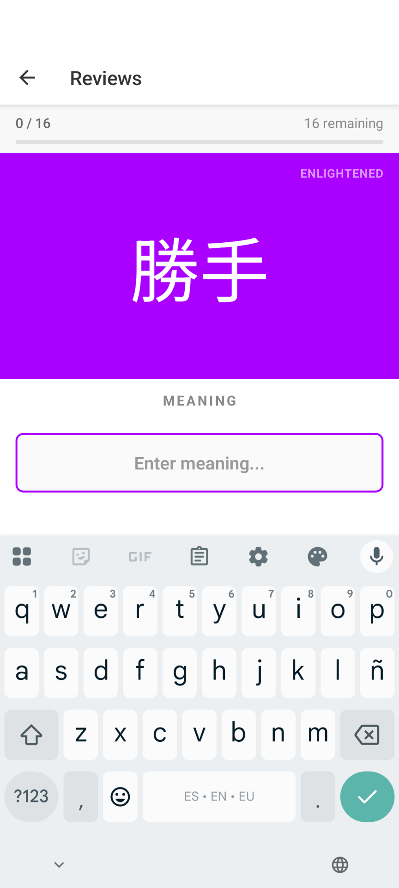
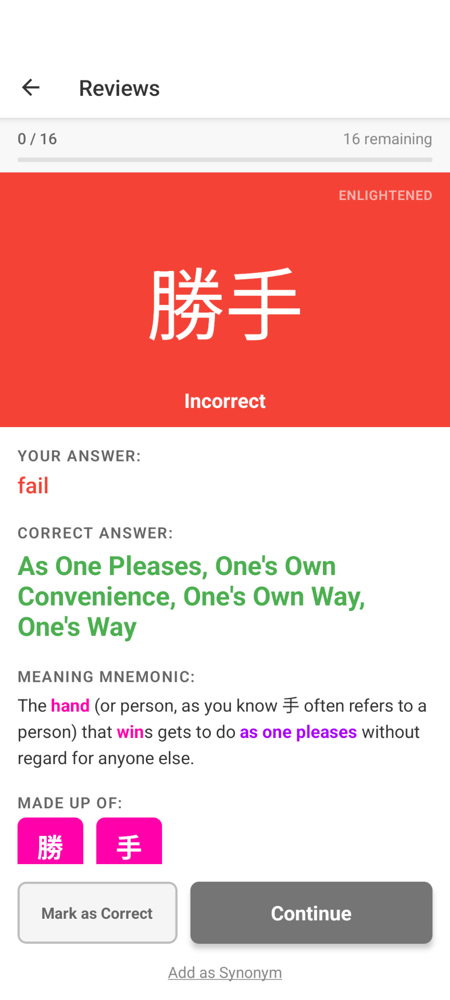
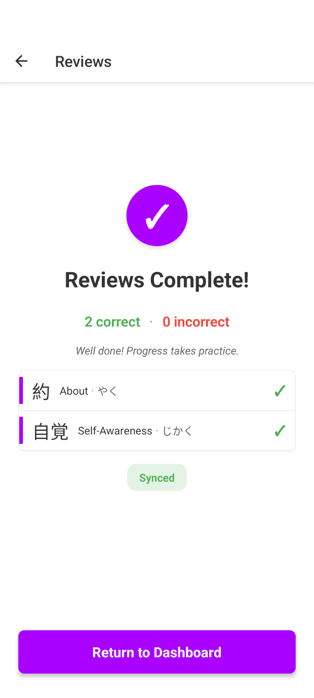
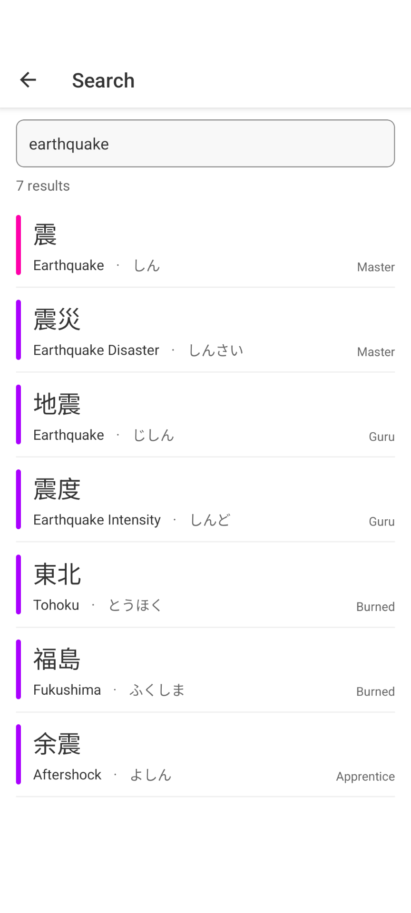
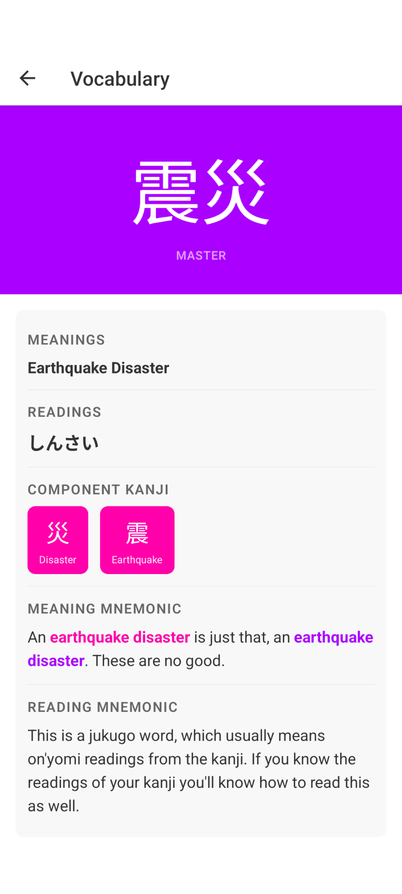
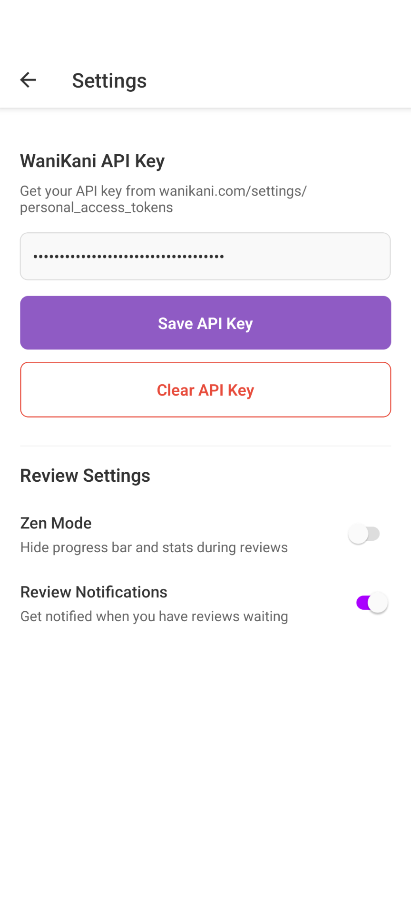

<p align="center">
  
</p>

<h1 align="center">Krabikani</h1>

<p align="center">
  A mobile companion app for <a href="https://www.wanikani.com/">WaniKani</a> with focus on <strong>flow</strong> and usability when doing lessons and reviews.
</p>

---

<p align="center">
  
  
  
  
  
</p>
<p align="center">
  
  
  
</p>

---

Built with React Native, Krabikani syncs with the WaniKani API and works offline so you can study anywhere.

## Features

### Dashboard
- See your available **lessons** and **reviews** at a glance
- **Upcoming reviews chart** showing your next 24 hours of scheduled reviews
- Current WaniKani **level** and **learned item counts**

### Lessons
- Step through new items with **lesson cards** showing characters, meanings, and readings
- **Lesson quiz** to confirm you've absorbed the material before moving on

### Reviews
- **SRS-based review sessions** with meaning and reading questions
- Answer validation with **typo tolerance** (fuzzy matching)
- **Wrap-up mode** to finish a session early at a natural stopping point
- **Zen mode** for a minimal, distraction-free review interface, if you prefer that
- A flow where the keyboard doesn't go away unless you answer incorrectly, keeping you in the zone and focused

### Search
- **Full-text search** across all learned radicals, kanji, and vocabulary
- Tap any result to view its **detail screen**

### Offline Support
- Local **SQLite database** stores all synced subjects and assignments
- **Pending reviews and lessons** are queued locally and synced when back online
- **Network status monitoring** with automatic sync on reconnect

### Others
- Hourly notifications if you have over 20 revies so you don't get behind
- Uses WaniKani's official color scheme for item types and SRS levels for maximum familiarity


## Running Locally

### Prerequisites

- **Node.js** >= 20
- **macOS** with **Xcode** (for iOS development)
- **Android Studio** (for Android development)
- A [WaniKani](https://www.wanikani.com/) account and **API key** (generate one at [wanikani.com/settings/personal_access_tokens](https://www.wanikani.com/settings/personal_access_tokens))

Make sure you've completed the [React Native environment setup](https://reactnative.dev/docs/set-up-your-environment) before proceeding.

### Install dependencies

```sh
npm install
```

For iOS, install CocoaPods (first time only):

```sh
bundle install
bundle exec pod install
```

### Start the app

```sh
# Start Metro bundler
npm start

# In a separate terminal — run on iOS
npm run ios

# OR run on Android
npm run android
```

On first launch, go to **Settings** and enter your WaniKani API key. The app will sync your data automatically.

### Quality checks

```sh
npm test          # Run tests
npm run typecheck  # TypeScript type checking
npm run lint       # ESLint
```

### Build for device

```sh
# Android — build and install release APK
npm run android:install

# iOS — use Xcode for device builds
open ios/Krabikani.xcworkspace
```

## Tech Stack

| Layer | Technology |
|---|---|
| Framework | React Native 0.83 + React 19 |
| Language | TypeScript |
| Navigation | React Navigation (native-stack) |
| Database | SQLite (op-sqlite) |
| Secure storage | react-native-keychain |
| Notifications | Notifee |
| Animations | react-native-reanimated |
| Testing | Jest + React Testing Library |
